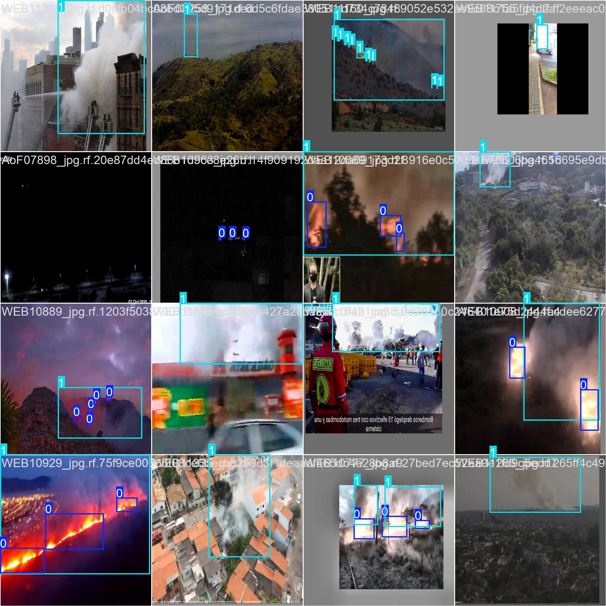

# Detector de Fumaça API

Este projeto apresenta uma API para detecção de fumaça e incêndio utilizando a arquitetura YOLO. Foi desenvolvido com base em conceitos de Clean Architecture e Código Limpo, visando facilitar a manutenção, escalabilidade e, principalmente, demonstrar a excelência técnica para a umgrauemeio.

## Sumário
- [Descrição do Projeto](#descrição-do-projeto)
- [Treinamento do Modelo](#treinamento-do-modelo)
- [Preparação dos Dados](#preparação-dos-dados)
- [Análise dos Resultados e Métricas](#análise-dos-resultados-e-métricas)
- [Hospedagem da API e Configuração do Servidor](#hospedagem-da-api-e-configuração-do-servidor)
- [Utilizando a API](#utilizando-a-api)
- [Por que Sou o Candidato Ideal?](#por-que-sou-o-candidato-ideal)

## Descrição do Projeto

A API foi desenvolvida para processar imagens e identificar áreas de fumaça e fogo, utilizando um modelo YOLO treinado em um dataset disponível no [Roboflow Universe](https://universe.roboflow.com/yolov9-9uvwb/yolov9-fire-and-smoke-dataset/dataset/1).

**Destaques:**
- **Arquitetura Limpa:** Separação de responsabilidades em _services_, _routes_, _utils_ e _external_.
- **Código Limpo:** Funções e classes com responsabilidades bem definidas e nomes expressivos.
- **Autenticação por Chave API:** Requisições à API exigem o header `x-api-key` com o valor **SOU_UM_GRAU_E_MEIO!**

## Treinamento do Modelo

O treinamento foi realizado utilizando o [YOLOv8n](https://docs.ultralytics.com/) – um modelo extremamente leve –, com as seguintes características:

- **Dataset:** Utilizado o dataset disponível em [Roboflow Universe](https://universe.roboflow.com/yolov9-9uvwb/yolov9-fire-and-smoke-dataset/dataset/1).
- **Divisão dos Dados:**  
  - 80% dos dados para treinamento  
  - 10% para validação  
  - 10% para teste
- **Configuração do Treinamento:**  
  - Modelo: `yolov8n.pt` (modelo leve)  
  - Épocas: 10 (um total de 4 horas de treinamento)  
  - Imagem: 640px de dimensão
- **Observação:**  
  O treinamento foi limitado, o que demonstra o potencial do modelo mesmo com recursos reduzidos. Com mais épocas e um modelo maior, os resultados podem ser significativamente aprimorados.

## Preparação dos Dados

Os dados foram organizados e divididos conforme mencionado, utilizando scripts para:
- **Criação de Diretórios:** Gerar pastas separadas para imagens de treinamento, validação e teste.
- **Embaralhamento:** As imagens foram randomizadas antes da divisão.
- **Movimentação de Arquivos:** Cada imagem e seu respectivo label foram movidos para os diretórios apropriados.

## Análise dos Resultados e Métricas

Foram gerados diversos gráficos e análises para entender o comportamento do modelo durante o treinamento:

### 1. **Correlograma de Labels**
- **Imagem:** `readme_images/labels_correlogram (1).jpg`  
- **Descrição:** Visualização da distribuição das bounding boxes. O gráfico mostra a relação entre:
  - Coordenadas x e y do centro das bounding boxes (normalizadas)
  - Largura e altura das boxes
- **Análise:**  
  - Predominância de caixas no centro da imagem.
  - Maioria das boxes pequenas, indicando que os eventos (fogo e fumaça) geralmente ocupam áreas menores.

  .jpg)

### 2. **Distribuição das Classes e Sobreposição de Bounding Boxes**
- **Imagem:** `readme_images/labels (1).jpg`  
- **Descrição:**  
  - Gráfico de barras mostrando a quantidade de instâncias por classe, onde "fire" possui mais instâncias do que "smoke".
  - Sobreposição das bounding boxes, evidenciando concentração no centro das imagens.

    .jpg)

### 3. **Análise Visual dos Treinamentos**
- **Imagem:** `readme_images/train_batch0.jpg`  
- **Descrição:** Exibição de um batch de treinamento com bounding boxes anotadas.  
- **Observações:**  
  - Variedade de condições de iluminação e posicionamento.
  - Evidência de múltiplas instâncias por imagem.

    

### 4. **Validação e Predições**
- **Imagem:** `readme_images/val_batch1_pred (1).jpg`  
- **Descrição:** Batch de validação com as predições do modelo.
- **Análise:**  
  - As caixas previstas indicam a capacidade do modelo de diferenciar entre fogo e fumaça.
  - Alguns ajustes podem ser necessários para melhorar a confiança das predições de "smoke".

    .jpg)

### 5. **Curvas de Desempenho**
- **Curva PR (Precision-Recall):** `readme_images/PR_curve (1).png`  
  - **Análise:** AP de ~0.564 para "fire" e ~0.607 para "smoke". mAP@0.5 de ~0.585.
  .png)
- **Curva F1-Confidence:** `readme_images/F1_curve (1).png`  
  - **Análise:** Melhor F1-score de 0.56 em um threshold de confiança de 0.274.
    .png)
- **Curva Precision-Confidence:** `readme_images/P_curve (1).png`  
  - **Análise:** 100% de precisão em threshold de 0.899, com trade-off no recall.
    .png)
- **Curva Recall-Confidence:** `readme_images/R_curve (1).png`  
  - **Análise:** Recall de 0.93 em threshold zero, indicando alta sensibilidade, mas com risco de falsos positivos.
    .png)
- **Matriz de Confusão Normalizada:** `readme_images/confusion_matrix_normalized (1).png`  
  - **Análise:** Evidencia os acertos e erros entre as classes, com pontos a melhorar na identificação de "fire".
    .png)
- **Gráficos de Treinamento:** `readme_images/results (1).png`  
  - **Análise:** Evolução das perdas e métricas (precisão, recall e mAP) demonstrando convergência sem overfitting severo.
    .png) 

## Hospedagem da API e Configuração do Servidor

A API foi desenvolvida e hospedada em um servidor rodando **AlmaLinux 8 64-bit**, com as seguintes configurações:

1. **Docker & Docker Compose:**  
   - A aplicação foi containerizada utilizando Docker, e orquestrada com Docker Compose.
   - Foi criado um `Dockerfile` para construir a imagem da aplicação, garantindo que todas as dependências (incluindo libGL, libglib, etc.) estejam disponíveis.

2. **Serviço Systemd:**  
   - Um arquivo `.service` foi criado para gerenciar o ciclo de vida da aplicação.
   - O arquivo (exemplo: `/etc/systemd/system/detector_de_fumaca.service`) aponta para o diretório do projeto e executa o comando `docker compose up --build`.
   - Isso garante que a API seja iniciada automaticamente e se mantenha em execução continuamente.

3. **Configurações de Rede e Segurança:**  
   - A porta **4000** foi aberta no firewall utilizando o `firewalld`:
     ```bash
     sudo firewall-cmd --permanent --zone=public --add-port=4000/tcp
     sudo firewall-cmd --reload
     ```
   - Essas configurações permitem que a API receba requisições de qualquer dispositivo na rede.

4. **Autenticação via Chave API:**  
   - Para acessar o endpoint, é necessário enviar o header `x-api-key` com a chave **SOU_UM_GRAU_E_MEIO!**.
   - Essa chave não apenas protege o endpoint, mas também serve como um toque pessoal, evidenciando minha identificação com a umgrauemeio e demonstrando que **"sou um grau e meio!"** – a prova de que eu sou o candidato ideal para a vaga!

## Utilizando a API

Para realizar requisições à API, siga o exemplo abaixo utilizando `curl`:

```bash
curl -X POST \
     -H "x-api-key: SOU_UM_GRAU_E_MEIO!" \
     -F "file=@{Caminho até a imagem .jpg}" \
     http://107.174.69.144:4000/api/detector_de_fumaca --output output.jpg
```

**Observações:**
- Substitua `107.174.69.144` pelo endereço IP público do seu servidor.
- A imagem processada será salva como `output.jpg`.
- Substitua o caminho até imagem pelo caminho até a imagem que você deseja classificar

## Por que Sou o Candidato Ideal?

Este projeto não é apenas uma demonstração técnica; ele é um case de excelência que integra:
- Treinamento de modelos de última geração com YOLO.
- Processos de divisão de dados e validação robustos.
- Implantação de uma API segura e escalável em um ambiente de produção (AlmaLinux 8).
- Criação de uma infraestrutura completa com Docker, Docker Compose e systemd.
- Uma chave API criativa e única (**SOU_UM_GRAU_E_MEIO!**) que simboliza meu comprometimento e alinhamento com a cultura da umgrauemeio.

Se você procura um profissional que alia conhecimento técnico com inovação e criatividade, estou pronto para fazer a diferença. **Vamos juntos elevar o padrão e transformar desafios em oportunidades!**

---
